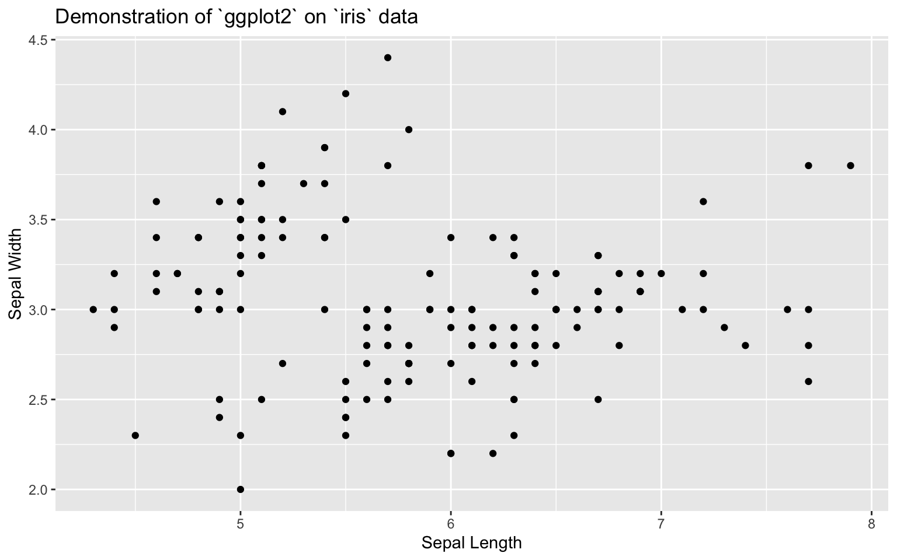
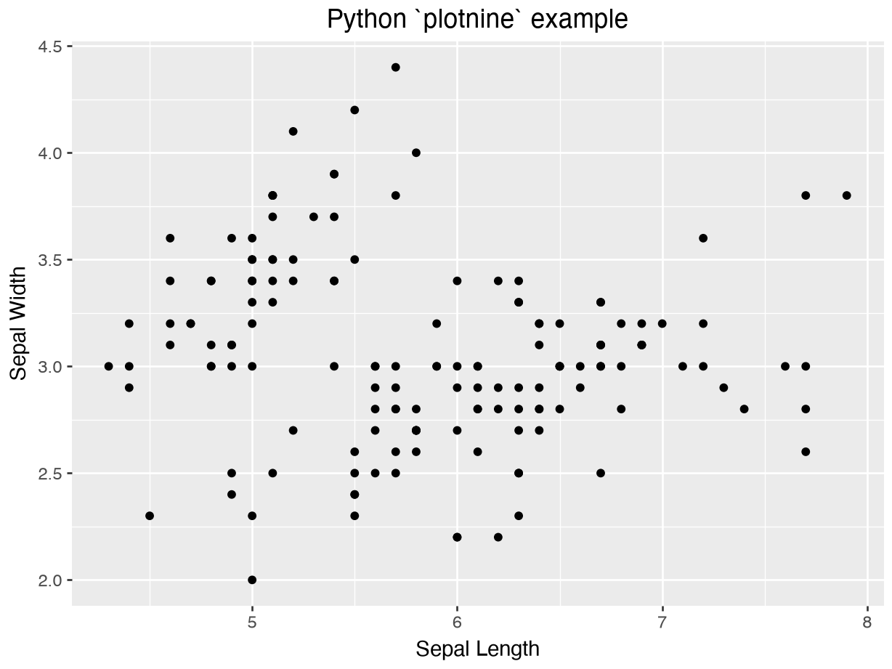
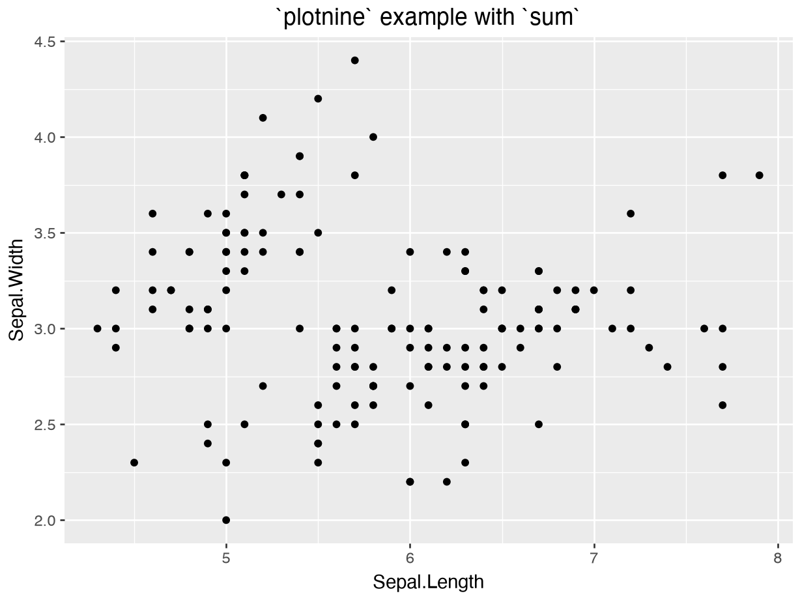
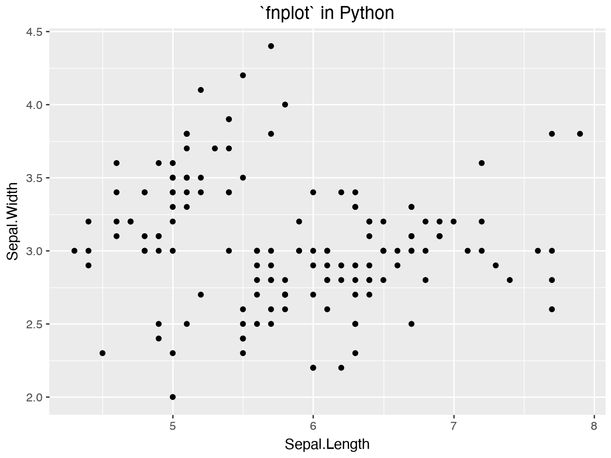
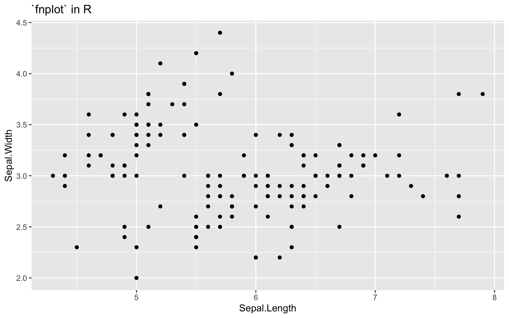

## Preamble

WHEREAS the R package `ggplot2` is a revolution for declarative, composable data science graphics,

WHEREAS the Python plotting ecosystem is dominated by imperative, stateful APIs for plotting like `matplotlib`,

WHEREAS Python packages like `seaborn`, `plotnine`, and `lets_plot` have aspired to reimplement the "grammar of graphics" that forms the design basis of `ggplot2` code,

I will assert that copying the exact *syntax* of `ggplot2` in Python not an important thing to do and causes headaches for users.
These packages have done great work to bring the grammar of graphics to Python.
Python users can reap these benefits just fine while deviating from the exact syntax.

## `ggplot2` in R

The design basis of `ggplot2` is a "grammar" that decomposes a graphic into orthogonal expressions that can be composed to achieve a variety of graphical creations.
These orthogonal expressions describe:

- data: a table where columns are located (and identifiable by name)
- aesthetic mapping: an association between columns in the data and visual dimensions of the graphic, including coordinate axes (x, y), colors, sizes, transparency, and so on.
- geometric representations of quantities: points, lines, bars, areas...

and so on.
If you are reading this post, I assume you are already familiar with this.[^1]

*As it happens*, the literal syntax of the `ggplot2` R package works by combining these expressions into a total plot by "adding" them with the `+` operator.
Your obligatory example:

``` r
library(ggplot2)

ggplot(data = iris) +
    aes(x = Sepal.Length, y = Sepal.Width) +
    geom_point() +
    labs(
        title = "Demonstration of `ggplot2` on `iris` data",
        x = "Sepal Length",
        y = "Sepal Width"
    )
```



I am specifically singling out the addition of expressions: `a + b + ... + z`.
This is how it is done in R.
It works fine in R.
Python, however...

## In Python

We will use `plotnine` as our `ggplot2` port in Python.

``` python
import plotnine as pn
```

The addition of expressions `a + b + ... + z` is painful in Python because Python has a different set of rules surrounding significant whitespace.
In R, if one line of code doesn't terminate an expression, the interpreter will continue interpreting future lines until the statement ends or raises.
In Python, a single line of code must terminate the expression (unless other steps are taken).
For example, our example plot fails if it is written like typical R code, because the lines ending with `+` are incomplete and raise a syntax error.

``` python
pn.ggplot(data = r.iris) +
    pn.aes(x = "Sepal.Length", y = "Sepal.Width") +
    pn.geom_point() +
    pn.labs(
        title = "Python `plotnine` example",
        x = "Sepal Length",
        y = "Sepal Width"
    )
## invalid syntax (<string>, line 1)
```

You must either line-break with `\` to tell the Python interpreter to keep the expression open...

``` python
pn.ggplot(data = r.iris) + \
    pn.aes(x = "Sepal.Length", y = "Sepal.Width") + \
    pn.geom_point() + \
    pn.labs(
        title = "Python `plotnine` example",
        x = "Sepal Length",
        y = "Sepal Width"
    )
```

...or you can scope the expression with parentheses.

``` python
(
    pn.ggplot(data = r.iris) +
        pn.aes(x = "Sepal.Length", y = "Sepal.Width") +
        pn.geom_point() +
        pn.labs(
            title = "Python `plotnine` example",
            x = "Sepal Length",
            y = "Sepal Width"
        )
)
```



This syntactic pain also appears when chaining dataframe transformations with `polars`.[^2]

``` python
# using parens to keep the expression alive across lines
result: pl.DataFrame = (
    df
    .with_columns(...)
    .filter(...)
    .groupby(...)
    .agg(...)
    .sort(...)
)
```

When you just want to type some code,[^3] both of these syntactic quirks are annoying.
I am not saying that R is "better" than Python in this regard.
It's just a difference.
To play devil's advocate, here is some perfectly valid but horrendous R code.

``` r
1 +


# ayyy lmao

         1
## [1] 2
```

So you can see that R isn't some paragon of syntactic hygiene by any means.

## Functional thinking, not syntax

My argument here is mainly that the `+` operation is truly irrelevant to the broader project of porting `ggplot2` ideas into Python.
The syntax that works in R does not work in Python without workarounds.
So what value is it to port to Python, really?[^4]
Watch as we make syntax a non-issue while keeping the important grammar components consistent.

We will do it by thinking functionally.
**What is the function that adds a bunch of things?**
Sum.

``` python
sum(
    [
        pn.aes(x = "Sepal.Length", y = "Sepal.Width"),
        pn.geom_point(),
        pn.ggtitle("`plotnine` example with `sum`")
    ],
    start=pn.ggplot(data = r.iris)
)
```



Sure... this is not the prettiest so far.
It is a little awkward because `sum` wants to initialize its result with the number `0`, so we have to set a different initial value.

But clearly we are getting somewhere.

Here is a trivial function that hides the boilerplate.

``` python
def fnplot(data, *components):
    return sum(components, start=pn.ggplot(data = data))
```

And now here is the feel that we achieve:

``` python
fnplot(
    r.iris,
    pn.aes(x = "Sepal.Length", y = "Sepal.Width"),
    pn.geom_point(),
    pn.ggtitle("`fnplot` in Python"),
)
```



**This looks perfectly fine to me.**
Readers of `ggplot2` code can understand perfectly well what this is doing.
The representation of the "grammar of graphics" is unaffected by our design, yet we have elided all syntactic pain from trying to make Python *look* like R.
Python doesn't look like R because it isn't R, and that's okay.
Code will write and read better if it's not fighting against the language you are using.

## Back to R

Just to hammer the broader "functions, not syntax" argument here, we can implement this same interface in R too.
The `sum` function won't work as our implementation layer without extra OOP legwork.
But that's okay, we can use `Reduce` because we know that `(sum x)` is functionally equivalent to `(reduce + x)`.

``` r
fnplot = function(data, ...) {
    Reduce(`+`, list(...), ggplot(data))
}


fnplot(
    iris,
    aes(x = Sepal.Length, y = Sepal.Width),
    geom_point(),
    ggtitle("`fnplot` in R")
)
```



## When I say "not important"...

Obviously there are pragmatic reasons for these packages to mirror the R syntax.
What I am saying, I guess, is that it is sort of unfortunate that we have to take this trade-off.

I am appealing to some sense in which function calls are universal syntax.
Whether it's a C-like language with `func(a, b)`, a Lisp with `(func a b)`, or a meta-language with `func a b`, these are all the same.

People joke that Lisps are languages that "contain no syntax".
This is not entirely true, but I take the point: I have no idea if any Lisps implement the grammar of graphics, but if any did, we already know how to write its `fnplot` implementation.

``` lisp
(fnplot
    iris
    (aes :x "Sepal.Length" :y "Sepal.Width")
    (geom_point)
    (ggtitle "`fnplot` in Lisp"))
```

And this is sort of the whole point with these "Sugar free" blog posts: how often is syntax a problem when the function is no problem?

[^1]: If not, here is the [cheat sheet](https://rstudio.github.io/cheatsheets/data-visualization.pdf).

[^2]: 
    Not coincidentally, the flow of `polars` syntax is greatly influenced by SQL and R (Tidyverse) code where multi-line expressions are natural for reading a chain of related operations.

[^3]: I don't know about you, but `ggplot`-style plotting is one area where it still feels faster to hand-type the code than explain what I want to an LLM agent.
    Suffice it so that neither language has a monopoly on hygienic syntax or anything.

[^4]: Thea argument is, of course, that familiarity encourages use.
    But the expressions like `geom_point(size = 2, alpha = 0.5)` are where the familiarity actually pays off, and these packages handle that just fine.
